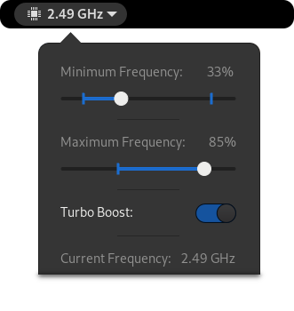

<h1 align="center">CPU Power Manager for Gnome Shell</h1>
<p align="center">
  
  <!--<a href="https://extensions.gnome.org/extension/945/cpu-power-manager/">
    
  </a>-->
  <br>
  <a href="https://github.com/deinstapel/cpupower/actions?query=workflow%3A%22latest%20build%22">
    
  </a>
  <a href="https://github.com/deinstapel/cpupower/actions?query=workflow%3A%22release%20build%22">
    
  </a>
  <a href="https://github.com/deinstapel/cpupower/releases">
    
  </a>
  
  <a href="https://github.com/deinstapel/cpupower/blob/master/LICENSE">
    
  </a>
  <a title="Crowdin" target="_blank" href="https://crowdin.com/project/cpupower">
    
  </a>
  <a href="http://makeapullrequest.com">
    
  </a>
  <br>
  <i>Gnome-Shell Extension for controlling the frequency setting of your CPU</i>
  <br><br>
  <a href="#prerequisites">Prerequisites</a> •
  <a href="#installation">Installation</a> •
  <a href="#translating">Translating</a> •
  <a href="#packaging">Packaging</a> •
  <a href="#developing">Developing</a>
</p>

## Prerequisites

You need to have a CPU which is supported by the **cpufreq** or **intel_pstate** CPU frequency scaling driver of the Linux kernel. This applies for most modern CPU's. Furthermore, the following software needs to be installed to use this extension:

- Gnome (since it's an extension)
- Policykit (ships default with gnome)
- For Intel Core CPU's `intel_pstate` needs to be enabled in the Linux kernel (should be the default in almost all Distros)
- For AMD Ryzen CPU's no further requirements are needed
- A POSIX compatible shell

### Installing via Makefile

In order to use the Makefile you need the following packages:

 - make
 - gettext
 - glib2 tools
 - zip and unzip
 - tar

## Installation

Installing this extension can either be done via distribution packages provided by us (recommended) or via the Gnome extensions website (often outdated). Have a look at the options below to find the correct installation method for your system.

> Info: The `$` at the beginning of a line means that this line should be run as the user who is using the extension (most likely you). If you don't know what that means, just open up a terminal and use it as is. Commands are run as your user by default.
> So for the line `$ echo Hello world` you would type `echo Hello world` into your terminal and hit enter.

> Info: The `#` at the beginning of a line means that this line must be run with `root` privileges.
> So for the line `# dnf update` you would then e.g. run `sudo dnf update` in you terminal if your system uses `sudo`. Your system is most likely using `sudo` and if not you would know it.

<details>
<summary><code>click to expand</code> Any newer Ubuntu release or Ubuntu based distribution. <b>If unsure do this!</b></summary>

To install the extension on any newer Ubuntu based system (e.g. PopOS) run the below commands.

> WARNING: This will **not*** work for ElementaryOS, Linux Mint, and any other Ubuntu which is not using the GNOME desktop environment. Running the below commands will likely break your system otherwise!

> Info: It is safe to install this extension if only a single package is installed by the below `apt-get install` command. If more packages are to be installed, please stop doing so and if unsure [create an issue](https://github.com/deinstapel/cpupower/issues/new/choose) asking for help!

```
$ sudo add-apt-repository ppa:fin1ger/cpupower
$ sudo apt-get update
$ sudo apt-get install gnome-shell-extension-cpupower
```

Now log out and back in again. Yes, this is really necessary thanks to Gnome. After logging back in, enable the extension with:

```
$ gnome-extensions enable cpupower@mko-sl.de
```

The extension should now be enabled and ready to use!

</details>

<details>
<summary><code>click to expand</code> Ubuntu 18.04 (Bionic Beaver)</summary>

To install this extension on Ubuntu Bionic Beaver please run the following commands:

```
$ sudo add-apt-repository ppa:fin1ger/cpupower
$ sudo apt-get update
$ sudo apt-get install gnome-shell-extension-cpupower
```

Now log out and back in again. Yes, this is really necessary thanks to Gnome. After logging back in, enable the extension with:

```
$ gnome-shell-extension-tool -e cpupower@mko-sl.de
```

The extension should now be enabled and ready to use!

</details>

<details>
<summary><code>click to expand</code> Debian or debian based distributions</summary>

To install the extension on any newer Debian based system run the below commands.

> WARNING: This will **not*** work when using any desktop environment other than GNOME. Running the below commands while using other desktop environments will likely break your system!

> Info: It is safe to install this extension if only a single package is installed by the below `apt-get install` command. If more packages are to be installed, please stop doing so and if unsure [create an issue](https://github.com/deinstapel/cpupower/issues/new/choose) asking for help!

```
# apt-key adv --keyserver keyserver.ubuntu.com --recv-keys D76A018A2B4E77F5
# add-apt-repository 'deb http://ppa.launchpad.net/fin1ger/cpupower/ubuntu hirsute main'
# apt-get update
# apt-get install gnome-shell-extension-cpupower
```

> Note: Debian is not using `sudo` by default. If you do not have `sudo`, get a `root` shell by typing `su` in a terminal and entering your superuser password.

Now log out and back in again. Yes, this is really necessary thanks to Gnome. After logging back in, enable the extension with:

```
$ gnome-extensions enable cpupower@mko-sl.de
```

The extension should now be enabled and ready to use!

</details>

<details>
<summary><code>click to expand</code> Fedora / CentOS / Mageia / OpenMandriva</summary>

To install this extension on most RPM based Linux distributions run the below commands.

> WARNING: This will **not*** work when using any desktop environment other than GNOME. Running the below commands while using other desktop environments will likely break your system!

> Info: It is safe to install this extension if only a single package is installed by the below `dnf install` command. If more packages are to be installed, please stop doing so and if unsure [create an issue](https://github.com/deinstapel/cpupower/issues/new/choose) asking for help!
```

# dnf copr enable fin_ger/cpupower
# dnf install gnome-shell-extension-cpupower
```

> You need to have the package `dnf-plugins-core` installed. If the above commands are failing try installing them with `dnf install dnf-plugins-core` and rerun the above commands.

Now log out and back in again. Yes, this is really necessary thanks to Gnome. After logging back in, enable the extension with:

```
$ gnome-extensions enable cpupower@mko-sl.de
```

The extension should now be enabled and ready to use!

</details>

<details>
<summary><code>click to expand</code> OpenSUSE</summary>

Download the appropriate `.repo` file for your OpenSUSE release (most likely the latest version) and save it to `/etc/zypp/repos.d/`. Now run the following commands:

```
# zypper install gnome-shell-extension-cpupower
```

Now log out and back in again. Yes, this is really necessary thanks to Gnome. After logging back in, enable the extension with:

```
$ gnome-extensions enable cpupower@mko-sl.de
```

The extension should now be enabled and ready to use!

</details>

<details>
<summary><code>click to expand</code> Install via the Gnome extension website (probably outdated)</summary>

Open the [`cpupower` Gnome extensions website](https://extensions.gnome.org/extension/945/cpu-power-manager/) in your default webbrowser. Click on the blue slider to install the extension.

After installation, click on the CPU icon in the top bar of your Gnome shell and follow the instructions. You need to enter your root password to install a policy kit rule. This rule is used to set the clock frequency of your CPU.

You are now ready to use this extension!

</details>

<details>
<summary><code>click to expand</code> Your distribution is not listed?</summary>

Fear not! We have other options for installing this extension. Although, you will not receive automatic updates which might be dangerous if we encounter security issues in the extension and you miss the fix for that issue. If you regularly check for updates yourself you can of course still use this extension without any risk.

If your distribution is capable of installing `DEB` or `RPM` packages, have a look at the [releases page](https://github.com/deinstapel/cpupower/releases) of this repository for downloadable pre-built packages.

Another option is to install the extension zip file manually. To do so, download the latest `zip` from the [release page](https://github.com/deinstapel/cpupower/releases). Now run the following commands:

```
$ gnome-extensions install /path/to/cpupower.zip
```

Now log out and back in again. Yes, this is really necessary thanks to Gnome. After logging back in, enable the extension with:

```
$ gnome-extensions enable cpupower@mko-sl.de
```

After enabling, click on the CPU icon in the top bar of your Gnome shell and follow the instructions. You need to enter your root password to install a policy kit rule. This rule is used to set the clock frequency of your CPU.

You are now ready to use this extension!

</details>

---

You are a developer or sysadmin and are looking for ways to install this extension directly from the git repository? Read on! The section below will explain in detail how to do so.

### Installing for another (admin) user

Impersonate the (admin) user, clone the git repository, and run the following command:

> Note: Cloning and installing the extension while impersonating the other user, enables this user
>       to install updates for this extension from extensions.gnome.org.

```shell
$ sudo -u username bash
$ cd /tmp
$ git clone https://github.com/deinstapel/cpupower.git
$ cd cpupower
$ make install PREFIX=/home/username/.local
```

Restart the gnome-shell (log out and back in) to make the extension available.

The user can enable the extension in his settings and install the polkit rule and `cpufreqctl` tool by using the included installation guide.

#### Uninstalling

The user can uninstall the tools in the settings of this extension. The extension itself can be removed from withing the extension settings or with this command:

```shell
$ make uninstall PREFIX=/home/username/.local
```

### Installing for another (non-admin) user

Impersonate the (non-admin) user, clone the git repository, and run the following command:

> Note: Cloning and installing the extension while impersonating the other user, enables this user
>       to install updates for this extension from extensions.gnome.org. However, the tool **must**
>       be updated and installed by an administrator. The extension may stop working after the user
>       installed an update and may need updating of the tool by an administrator.

```shell
$ sudo -u username bash
$ cd /tmp
$ git clone https://github.com/deinstapel/cpupower.git
$ cd cpupower
$ make install PREFIX=/home/username/.local
```

And with an admin user run the following commands:

```shell
$ sudo make install-tool TOOL_SUFFIX=username
```

> Note: Also, use this command to update the tool for another user in an outdated installation.

> Note: Using another PREFIX than `/usr` in this setup might include security risks and may not work.

Restart the gnome-shell (log out and back in) to make the extension available.

The extension will work out-of-the-box for this user only!

#### Uninstalling

```shell
$ sudo make uninstall PREFIX=/home/username/.local
$ sudo make uninstall-tool TOOL_SUFFIX=username
```

### Installing for all users

Clone the git repository and run the following command:

```shell
$ sudo make install install-tool
```

This will install the extensions, polkit rule, and the tool for all users on the system.

#### Uninstalling

Run the following command to uninstall:

```shell
$ sudo make uninstall uninstall-tool
```

## Translating

`cpupower` now uses [crowdin](https://crowdin.com/project/cpupower) for translation. You are free to choose from manually translating this extension with tools like [`Poedit`](https://poedit.net/) or using the online service of crowdin.

### Translating with crowdin

First visit the [project page](https://crowdin.com/project/cpupower) of `cpupower` on crowdin and select the language you would like to translate to. Now, click on `Translate All` and you're good to go.

### Manual translation method

In order to translate this extension with [`Poedit`](https://poedit.net/) you first need to install it. You may use your distributions package manager for installation.

When finished, [fork](https://help.github.com/en/github/getting-started-with-github/fork-a-repo) this project and clone like described in the linked guide.

#### Creating a new translation

Open Poedit and select `File` / `New From POT/PO File...` and select `cpupower/locale/template.pot`. Select the language you want to translate to. Now start translating.

#### Edit or update an existing translation

Open Poedit and select `Open`. Navigate to the `cpupower/locale` folder and select the language file (`.po`) you want to edit/update. Now select `Catalog` / `Update from POT File...` and select `cpupower/locale/template.pot`. Now, you can start updating the translation.

#### Saving your work

When finished save the file into the `locale` folder and [push](https://help.github.com/en/github/managing-files-in-a-repository/adding-a-file-to-a-repository-using-the-command-line) your changes to your fork. Now, you can create a [pull request](https://help.github.com/en/github/collaborating-with-issues-and-pull-requests/creating-a-pull-request) to make your translation available in the main cpupower installation.

## Packaging

You are a package maintainer and looking into packaging this extension? Great! Below is a short summary of how to properly install this extension (run as `root`):

```shell
# make install install-tool PREFIX=/usr
```

This will install a polkit rule to `/usr/share/polkit-1/actions/mko.cpupower.setcpufreq.policy` and an executable bash script to `/usr/bin/cpufreqctl`. The extension is installed to `/usr/share/gnome-shell/extensions/cpupower@mko-sl.de`. It still includes the `scripts` folder, the policykit rule template in `data/mko.cpupower.policy.in`, a useless copy of the tool in the `tool` folder, and the `Makefile`. These are included in the distribution of the extension to enable user installation if the extension got installed over the GNOME extensions website. If you do not want to distribute those files in your package, you can safely remove them.

> If you find any issues in packaging this extension, please don't hesitate to report them!

## Developing

### Option 1

Clone the repository and run:

```shell
$ make install PREFIX=/home/username/.local
```

and reload the extension by restarting your gnome-shell.

### Option 2

Clone the respository to `~/.local/share/gnome-shell/extensions/cpupower@mko-sl.de` and reload the extension by restarting your gnome-shell.

You can now enable the extension in your extension settings.

### Viewing log output

```shell
$ journalctl /usr/bin/gnome-shell -f
```

### Creating a new release

Only core contributors to this project can make a new release. To create one, run:

```shell
$ make release
```
